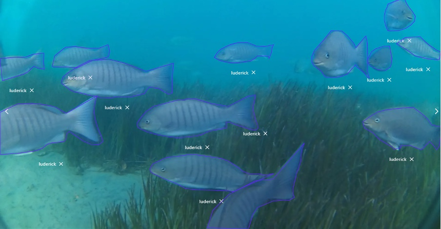

# Annotated videos of luderick from estuaries in southeast Queensland, Australia

[![CC BY 4.0][cc-by-shield]][cc-by]
[![DOI][doi-shield]][doi-url]

[cc-by]: http://creativecommons.org/licenses/by/4.0/
[cc-by-shield]: https://img.shields.io/badge/License-CC%20BY%204.0-lightgrey.svg
[doi-shield]: https://img.shields.io/badge/DOI-10.1594%2FPANGAEA.926930-blue
[doi-url]: https://doi.org/10.1594/PANGAEA.926930



## Overview

This dataset comprises of annotated footage of _Girella tricuspidata_ in two estuary systems in south East Queensland, Australia. This data is suitable for a range of classification and object detection research in unconstrained underwater environments. The raw data was obtained using submerged action cameras (Haldex Sports Action Cam HD 1080p) to collect video footage in the Tweed River estuary in southeast Queensland (-28.169438, 153.547594), between February and July 2019. Additional footage was collected from seagrass meadows in a separate estuary system in Tallebudgera Creek (-28.109721, 153.448975). Each sampling day, six cameras were deployed for 1 h over a variety of seagrass patches; the angle and placement of cameras was varied among deployment to ensure a variety of backgrounds and fish angles. Videos were trimmed for training to contain only footage of luderick (the target species for the study) and split into 5 frames per second.

## Dataset presentation

This dataset includes 9429 annotations and 4280 images which can be used for training object detection deep learning models and other related computer vision tasks. The dataset is organised into 3 sub-datasets that have been allocated for training, test and novel test purposes.

| Dataset                        | ID        | Raw Videos                              | Version | Suggested use | Luderick Annotations | Bream Annotations | Total |
| ------------------------------ | --------- | --------------------------------------- | ------- | ------------- | -------------------- | ----------------- | ----- |
| Luderick Seagrass Jack Evans A | Wvo7U_76t | [Download (1.3GB)][jack evans a videos] | 8       | training      | 6649                 | 53                | 6702  |
| Luderick Seagrass Jack Evans B | OmKwIVpe- | [Download (1.1GB)][jack evans b videos] | 8       | test          | 1632                 | 29                | 1661  |
| Luderick Seagrass Tallebudgera | 4bUBoZmvV | [Download (576MB)][tallebudgera videos] | 6       | novel test    | 1023                 | 43                | 1066  |
| Total                          |           |                                         |         | 9304          | 125                  | 9429              |

<!-- Video .zip Links -->

[jack evans a videos]: https://globalwetlands.blob.core.windows.net/globalwetlands-public/datasets/luderick-seagrass/videos/Wvo7U_76t.zip
[jack evans b videos]: https://globalwetlands.blob.core.windows.net/globalwetlands-public/datasets/luderick-seagrass/videos/OmKwIVpe-.zip
[tallebudgera videos]: https://globalwetlands.blob.core.windows.net/globalwetlands-public/datasets/luderick-seagrass/videos/4bUBoZmvV.zip

> **Images are included in a ZIP archive which can be downloaded from either of the following:**  
> * https://download.pangaea.de/dataset/926930/files/Fish_automated_identification_and_counting.zip
> * https://globalwetlands.blob.core.windows.net/globalwetlands-public/datasets/luderick-seagrass/luderick-seagrass.zip

Each annotation includes object instance annotations which consist of the following key fields: Labels are provided as a common name: either "luderick" for _Girella tricuspidata_ or "bream" for _Acanthopagrus australis_; Bounding boxes that enclose the species in each frame are provided in "[x, y, width, height]" format, in pixel units; Segmentation masks which outline the species as a polygon are provided as a list of pixel coordinates in the format "[x, y, x, y, ...]"; The corresponding image is provided as an image filename. All image coordinates (bounding box and segmentation masks) are measured from the top left image corner and are 0-indexed.

Annotations are provided in both CSV format and [COCO JSON format](https://cocodataset.org/#format-data) which is a commonly used data format for integration with object detection frameworks including PyTorch and TensorFlow.

Additional details for each image can be found in [`dataset_images.csv`](dataset_images.csv), including data collection deployment dates, geo-coordinates and habitat type.

### COCO JSON

Each annotation in COCO JSON format includes the following fields:

| Key          | Description                                                                         |
| ------------ | ----------------------------------------------------------------------------------- |
| id           | INT annotation ID                                                                   |
| category_id  | INT category ID                                                                     |
| image_id     | INT image ID                                                                        |
| bbox         | ARRAY [x, y, width, height] of bounding box in px                                   |
| area         | INT area of bounding box in pixels squared                                          |
| segmentation | STR segmentation polygon coordinates in format "[[x, y, x, y, ...]]"                |
| iscrowd      | INT 0 or 1. A value of 1 indicated the annotation includes more than one individual |

Each image in COCO JSON format includes the following fields:

| Key       | Description           |
| --------- | --------------------- |
| id        | INT image ID          |
| height    | INT image height (px) |
| width     | INT image width (px)  |
| file_name | STR image filename    |

Each category in COCO JSON format includes the following fields:

| Key  | Description                             |
| ---- | --------------------------------------- |
| id   | INT category ID                         |
| name | STR category name (species common name) |

#### COCO JSON Example

```json
{
  "annotations": [{
    "id": 0,
    "image_id": 0,
    "category_id": 1,
    "bbox": [ 0, 76, 624, 1003 ],
    "iscrowd": 0,
    "area": 625872,
    "segmentation": [
      [ 5, 76, 154, 80, 409, 76, 471, 86, 546, 110 ]
    ]
  }],
  "images": [{
      "file_name": "20190618_1.mov_5fps_000001.jpg",
      "height": 1080,
      "width": 1920,
      "id": 0,
      "license": 1
    }
  ],
  "categories": [{
    "name": "luderick",
    "id": 1
  }]
```

### CSV

For each annotation in CSV format, the following columns are provided:

| Column       | Description                                                          |
| ------------ | -------------------------------------------------------------------- |
| id           | INT annotation ID                                                    |
| category     | STR name of category (luderick/bream)                                |
| category_id  | INT category ID                                                      |
| image        | STR image file name                                                  |
| image_id     | INT image ID                                                         |
| bbox_x       | INT minimum x pixel coordinate of bounding box                       |
| bbox_y       | INT minimum y pixel coordinate of bounding box                       |
| bbox_w       | INT width of bounding box in pixels                                  |
| bbox_h       | INT height of bounding box in pixels                                 |
| area         | INT area of bounding box in pixels squared                           |
| segmentation | STR segmentation polygon coordinates in format "[[x, y, x, y, ...]]" |

#### CSV Example

| id  | category | category_id | image                          | image_id | bbox_x | bbox_y | bbox_w | bbox_h | area   | segmentation     |
| --- | -------- | ----------- | ------------------------------ | -------- | ------ | ------ | ------ | ------ | ------ | ---------------- |
| 0   | luderick | 1           | 20190618_1.mov_5fps_000001.jpg | 0        | 0      | 76     | 624    | 1003   | 625872 | "[[5, 76, ...]]" |
